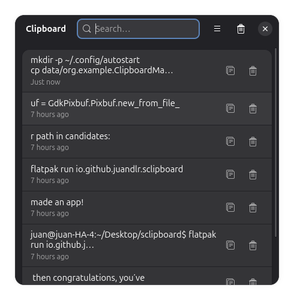

# SClipboard

SClipboard is a modern simple clipboard history manager for GNOME, built with GTK4 and Libadwaita.




## Features

- 📋 Real-time clipboard monitoring (X11/XWayland)
- 🔍 Search and filter clipboard history
- 🖼️ Text and image clipboard support
- 🎯 System tray icon with context menu
- ⚙️ Configurable max history items
- 👁️ Optional auto-hide after copying
- 💾 Persistent history (JSON)

## Requirements

- Python 3
- GTK 4
- Libadwaita 1
- PyGObject

```bash
sudo apt install python3 python3-gi gir1.2-gtk-4.0 gir1.2-adw-1
```

## Run directly

```bash
python3 src/main.py
```

## Desktop launcher

```bash
mkdir -p ~/.local/share/applications
cp data/io.github.juandlr.sclipboard.desktop ~/.local/share/applications/
```

Install the GSettings schema:

```bash
mkdir -p ~/.local/share/glib-2.0/schemas
cp data/io.github.juandlr.sclipboard.gschema.xml ~/.local/share/glib-2.0/schemas/
glib-compile-schemas ~/.local/share/glib-2.0/schemas/
```

## License

MIT

## Credits

Vibecoded with ❤️ using [Copilot](https://github.com/features/copilot) and [DeepSeek](https://deepseek.com)

App icon by [Flaticon](https://www.flaticon.com/)
